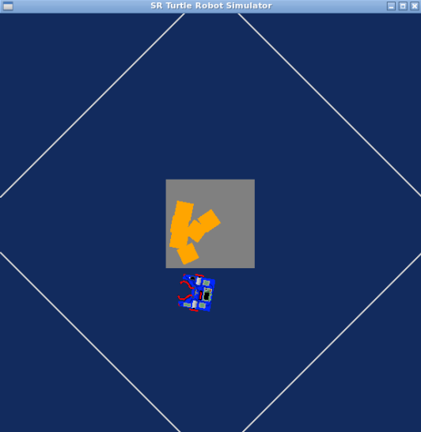

Research_Track1_Assignment1
------------------------------------------------
It's the first assignment that the Robot grabs all the markers and put'em all in the same place next to eachother. I also attached the necessary files and images of the Robot, markers and the whole environment.


> Figure1) The starter place configuration of the Robot and environment


> Figure2) Final configuration of the Robot and markers


> Figure3) The flowchart

Python Robotics Simulator
================================

This is a simple, portable robot simulator developed by [Student Robotics](https://studentrobotics.org).
Some of the arenas and the exercises have been modified for the Research Track I course

Installing and running
----------------------

The simulator requires a Python 2.7 installation, the [pygame](http://pygame.org/) library, [PyPyBox2D](https://pypi.python.org/pypi/pypybox2d/2.1-r331), and [PyYAML](https://pypi.python.org/pypi/PyYAML/).

Pygame, unfortunately, can be tricky (though [not impossible](http://askubuntu.com/q/312767)) to install in virtual environments. If you are using `pip`, you might try `pip install hg+https://bitbucket.org/pygame/pygame`, or you could use your operating system's package manager. Windows users could use [Portable Python](http://portablepython.com/). PyPyBox2D and PyYAML are more forgiving, and should install just fine using `pip` or `easy_install`.

## Troubleshooting

When running `python run.py <file>`, you may be presented with an error: `ImportError: No module named 'robot'`. This may be due to a conflict between sr.tools and sr.robot. To resolve, symlink simulator/sr/robot to the location of sr.tools.

On Ubuntu, this can be accomplished by:
* Find the location of srtools: `pip show sr.tools`
* Get the location. In my case this was `/usr/local/lib/python2.7/dist-packages`
* Create symlink: `ln -s path/to/simulator/sr/robot /usr/local/lib/python2.7/dist-packages/sr/`

## Exercise
-----------------------------

To run one or more scripts in the simulator, use `run.py`, passing it the file names. 
You can run the program with:

```bash
$ python2 run.py assignment.py
```

Robot API
---------

The API for controlling a simulated robot is designed to be as similar as possible to the [SR API][sr-api].

### Motors ###

The simulated robot has two motors configured for skid steering, connected to a two-output [Motor Board](https://studentrobotics.org/docs/kit/motor_board). The left motor is connected to output `0` and the right motor to output `1`.

The Motor Board API is identical to [that of the SR API](https://studentrobotics.org/docs/programming/sr/motors/), except that motor boards cannot be addressed by serial number. So, to turn on the spot at one quarter of full power, one might write the following:

```python
R.motors[0].m0.power = 25
R.motors[0].m1.power = -25
```

### The Grabber ###

The robot is equipped with a grabber, capable of picking up a token which is in front of the robot and within 0.4 metres of the robot's centre. To pick up a token, call the `R.grab` method:

```python
success = R.grab()
```

The `R.grab` function returns `True` if a token was successfully picked up, or `False` otherwise. If the robot is already holding a token, it will throw an `AlreadyHoldingSomethingException`.

To drop the token, call the `R.release` method.

Cable-tie flails are not implemented.

### Vision ###

To help the robot find tokens and navigate, each token has markers stuck to it, as does each wall. The `R.see` method returns a list of all the markers the robot can see, as `Marker` objects. The robot can only see markers which it is facing towards.

Each `Marker` object has the following attributes:

* `info`: a `MarkerInfo` object describing the marker itself. Has the following attributes:
  * `code`: the numeric code of the marker.
  * `marker_type`: the type of object the marker is attached to (either `MARKER_TOKEN_GOLD`, `MARKER_TOKEN_SILVER` or `MARKER_ARENA`).
  * `offset`: offset of the numeric code of the marker from the lowest numbered marker of its type. For example, token number 3 has the code 43, but offset 3.
  * `size`: the size that the marker would be in the real game, for compatibility with the SR API.
* `centre`: the location of the marker in polar coordinates, as a `PolarCoord` object. Has the following attributes:
  * `length`: the distance from the centre of the robot to the object (in metres).
  * `rot_y`: rotation about the Y axis in degrees.
* `dist`: an alias for `centre.length`
* `res`: the value of the `res` parameter of `R.see`, for compatibility with the SR API.
* `rot_y`: an alias for `centre.rot_y`
* `timestamp`: the time at which the marker was seen (when `R.see` was called).

For example, the following code lists all of the markers the robot can see:

```python
markers = R.see()
print "I can see", len(markers), "markers:"

for m in markers:
    if m.info.marker_type in (MARKER_TOKEN_GOLD, MARKER_TOKEN_SILVER):
        print " - Token {0} is {1} metres away".format( m.info.offset, m.dist )
    elif m.info.marker_type == MARKER_ARENA:
        print " - Arena marker {0} is {1} metres away".format( m.info.offset, m.dist )
```
Coding
----------------------
The Robot should grab all the markers and put'm all together. To do this, I defined some functions below:
a_th: Threshold for the control of the orientation
d_th: Threshold for the control of the linear distance
GrabbedGold: I list this so the Robot ignores to grab the old markers and searching for the new markers as well
drive: Robot driving
turn: turning the Robot
find_gold_token: finding for the closest token
release_find_token()
grabbing()
Release_Grabbed_Gold()

### drive ###
Function for setting a linear velocity
Speed: the speed of the wheels
Seconds: the time interval
```python
def drive(speed, seconds):

    R.motors[0].m0.power = speed
    R.motors[0].m1.power = speed
    time.sleep(seconds)
    R.motors[0].m0.power = 0
    R.motors[0].m1.power = 0
```
### turn ###
Function for setting an angular velocity
```python
def turn(speed, seconds):

    R.motors[0].m1.power = -speed
    time.sleep(seconds)
    R.motors[0].m0.power = 0
    R.motors[0].m1.power = 0
```
### def find_gold_token ###
Function to find the closest token
```python
def find_gold_token():

	dist = 100
	for token in R.see():
		if token.dist<dist and token.info.marker_type == MARKER_TOKEN_GOLD and token.info.code not in GrabbedGold:   
			dist = token.dist
			rot_y = token.rot_y
			Code = token.info.code	
	if dist == 100:
	
		return -1 , -1 ,-1
	
	else:
		return dist, rot_y ,Code
```
### release_find_token ###
```python
def release_find_token():

	dist =100
	
	
	for token in R.see():
	
		if token.dist<dist and token.info.marker_type == MARKER_TOKEN_GOLD and token.info.code in GrabbedGold:
		
			dist = token.dist
			rot_y = token.rot_y
			Code = token.info.code
			
	if dist == 100:
	
		return -1 , -1 ,-1
	
	else:
		return dist, rot_y ,Code
```
### grabbing ###
```python
def grabbing():

	while True:
	
	    dist, rot_y ,Code= find_gold_token()  # we look for markers
	    
	    if dist <= d_th: # if we are close to the token, we grab it
		print("Aha, Found it!")	 
		
		break
	    elif -a_th<= rot_y <= a_th: # if the robot is well aligned with the token, we go forward
		print("I'm getting closer!")
		drive(20, 1)
	    elif rot_y < -a_th: # if the robot is not well aligned with the token, we move it on the left or on the right
		print("I'm on my way")
		turn(-2, 0.5)
	    elif rot_y > a_th:
		print("Waiting...")
		turn(20, 1)
```
### Release_Grabbed_Gold ###
```python
def Release_Grabbed_Gold():

	while True:
	    dist, rot_y ,Code= release_find_token()  # we look for any dropped markers
	    
	    if dist <d_th + 0.1:  # if we are close to the dropping token location, the robot can release the last marker/0.1 is the distance between the placed marker
		
		break
	    elif -a_th<= rot_y <= a_th: # if the robot is well aligned with the dropping location, we go forward
		print("I'm getting closer!")
		drive(20, 1)
	    elif rot_y < -a_th: # if the robot is not well aligned with the dropping location, we move it on the left or on the right
		print("I'm on my way")
		turn(-2, 0.5)
	    elif rot_y > a_th:
		print("Waiting...")
		turn(20, 1)
```
### while ###
Now with all these described functions, let's describe the main code that make the Robot grabs and places all the markers together. If robot could't find any markers then it turns around to find anyone. The Robot tries to grab and put the first marker in the described location and list that marker as it read and looks for any new markers to hold and put next to previous one.
```python
dist, rot_y, code= find_gold_token() # the robot is tring to find the closest marker
while dist == -1:  # if the robot can't find any markers, searching until finds'em all
	print("Searching...")
	turn(20,2)
	dist, rot_y, code = find_gold_token() # the robot moves toward the released marker and grabs'em
grabbing()  
R.grab()
print("Yeah, I did it!") # the robot moves toward the defined dropping location
turn(-20,1)
drive(20 , 9)
R.release()
print("Done")
turn(20,4)
	
# the robot lists the marker's code, searching for the other markers to add
GrabbedGold.append(code)
	
# the robot do these orders, till puts every markers together
while len(GrabbedGold):		
# the robot moves toward the released marker and grabs'em
	dist, rot_y, code = find_gold_token()
	while dist == -1:
		print("Searching...")
		turn(20,2)
		dist ,rot_y, code = find_gold_token()
	grabbing()
	R.grab()
	print("Yeah, I did it!")		
	# the robot moves toward the defined dropping location with the grabbed marker
	dist1, rot1_y, code1 = release_find_token()
		
	# for the first round of the loop the robot brings the markers to the reference marker
	while dist1 == -1:
		print("Confusing!!!")
		turn(20,2)
		dist1, rot1_y, code1 = release_find_token()
	Release_Grabbed_Gold()
	R.release()
	print("Well, done. Hoorayyyyyyyyyyyyy") # the robot keeps turning
	drive(-20,2)
	turn(20,2)
		
	# the robot lists the marker's code, searching for the other markers to add
	GrabbedGold.append(code)
```
[sr-api]: https://studentrobotics.org/docs/programming/sr/
